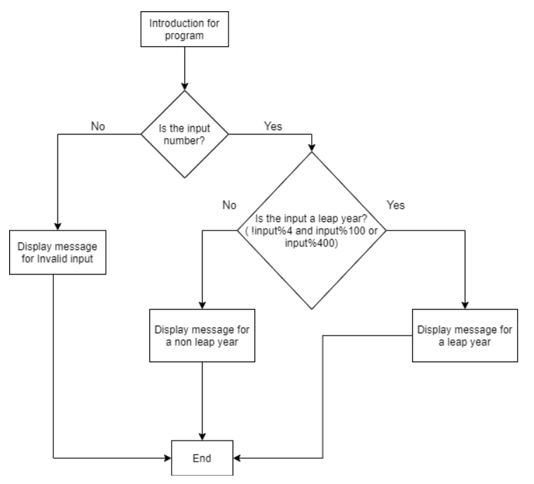

# Leap Year Program

this program calculates if the year is a leap year. 

To run the code withour error handling: python satoru_yamamoto_hw3.1.py  
To run the code with error handling: python satoru_yamamoto_hw3.2.py  
## Flow chart of program with error handling

